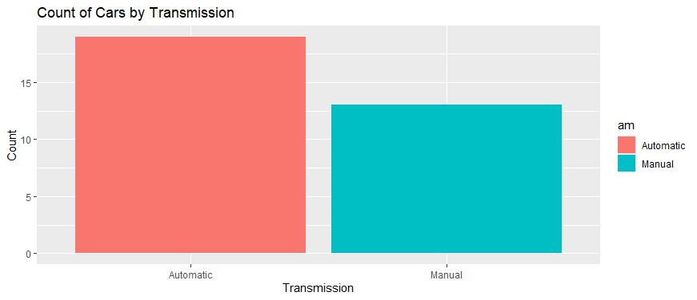
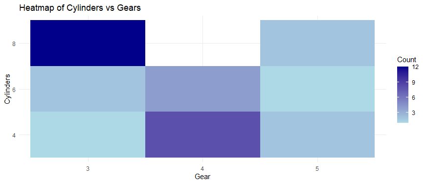
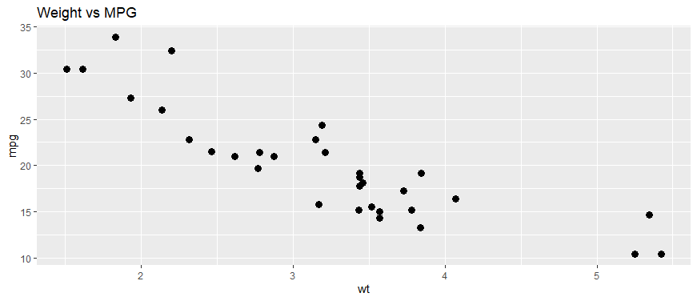
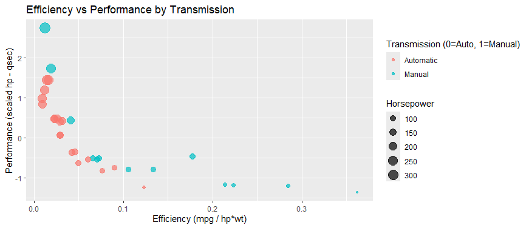
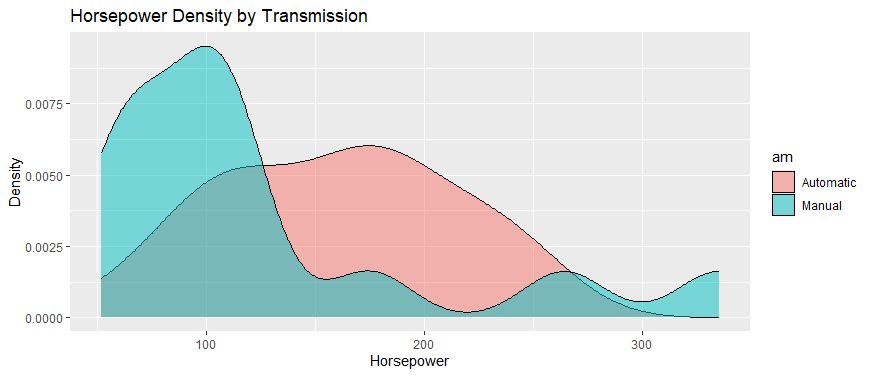
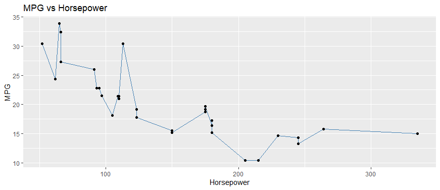

# Performance and Efficiency: A Data-Driven Analysis of Vehicle Metrics

A data analysis project exploring the trade-offs between vehicle performance and fuel efficiency using the classic `mtcars` dataset. The project examines how horsepower, weight, cylinders, displacement, and transmission type interact to shape fuel economy — and translates those findings into actionable business recommendations.

---

## Table of Contents

- [Overview](#-overview)
- [Data Source](#-data-source)
- [Data Preparation](#-data-preparation)
- [Analysis & Insights](#-analysis--insights)
  - [Distribution of Cars by Transmission Type](#1-distribution-of-cars-by-transmission-type)
  - [Cylinders vs Gears](#2-cylinders-vs-gears-key-differences)
  - [MPG Distribution Overview](#3-mpg-distribution-overview)
  - [Efficiency vs Performance vs Transmission](#4-efficiency-vs-performance-vs-transmission)
  - [Horsepower Density by Transmission Type](#5-horsepower-density-by-transmission-type)
  - [MPG vs Horsepower](#6-mpg-vs-horsepower-exploring-the-trade-off)
- [Key Conclusions](#-key-conclusions)
- [Tech Stack](#-tech-stack)

---

## Overview

This project analyzes vehicle performance and efficiency using key metrics such as miles per gallon (MPG), horsepower, weight, cylinders, displacement, and transmission type. The visualizations reveal a consistent trade-off between power and fuel economy: heavier, higher-horsepower cars tend to deliver lower MPG.

The goal is to translate these patterns into insights that manufacturers, fleet managers, and marketers can use to shape product strategy, pricing, and customer targeting.

## Data Source

- **Dataset:** [`mtcars`](https://stat.ethz.ch/R-manual/R-devel/library/datasets/html/mtcars.html) — a built-in dataset available in RStudio, originally sourced from *Motor Trend* magazine (1974 US road tests).
- **R File:** [`mtcars`](https://github.com/Sakib007q/mtcars_analysis/blob/main/mtcars.R)

## Data Preparation

- Converted categorical variables to factors for accurate grouping and visualization: `cyl`, `carb`, `gear`, `am`, `vs`

## Analysis & Insights

### 1. Distribution of Cars by Transmission Type

Automatic transmissions outnumber manual transmissions in the dataset, suggesting a general buyer preference for automatics — likely driven by convenience, comfort, and advanced drivetrain features. A smaller segment of manual-transmission buyers appears to prioritize lower purchase price, reduced maintenance costs, and better fuel economy.

**Recommendation:** Increase inventory of automatic vehicles to match market demand, while maintaining manual servicing capability (clutch systems, gear synchronizers, cables) to capture the maintenance/parts opportunity from the manual segment.

### 2. Cylinders vs Gears: Key Differences

8-cylinder vehicles cluster around 3 or 5 gears. These are typically high-performance vehicles (muscle cars, heavy-duty trucks) whose powerful engines don't require as many gears to deliver strong acceleration and torque.

**Recommendation:** Offer specialized tuning services for 8-cylinder vehicles to optimize gear ratios, torque delivery, and fuel efficiency — appealing to owners seeking more power or modestly improved fuel economy.

### 3. MPG Distribution Overview

Most vehicles cluster in the 15–22 MPG range, with a small number of high-efficiency outliers exceeding 30 MPG. High-MPG vehicles represent a smaller share of the market.

**Recommendation:** Position high-MPG models as the go-to choice for fleet buyers and economy-focused consumers, emphasizing long-term fuel cost savings tied to lighter vehicle weight.

### 4. Efficiency vs Performance vs Transmission

Higher-performance cars (measured via horsepower–quarter-mile time) generally show lower efficiency (MPG relative to horsepower × weight) — a clear power/economy trade-off. Manual transmissions tend to be more efficient than automatics at similar performance levels, particularly in the mid-range, while automatics dominate the high-performance segment (often paired with larger engines).

**Recommendation:** Guide commercial/fleet buyers toward lighter manual vehicles for efficiency, and performance-oriented buyers toward automatic, high-horsepower models. Longer term, invest in hybrid, electric, or advanced transmission technology to shift this trade-off curve.

### 5. Horsepower Density by Transmission Type

Manual vehicles concentrate in the lower horsepower range (roughly 50–150 hp), aligning with efficiency-focused, budget-conscious buyers. Automatic vehicles dominate the 150–250 hp range, aligning with premium/performance-oriented demand. High-horsepower outliers (300+ hp) exist in both categories but remain a niche segment.

**Recommendation:** Market manuals as the "fuel-smart choice" for commuters and fleet buyers, and automatics as "power and comfort without compromise" for premium segments. Stock automatic transmission parts more heavily given higher wear/repair demand in that segment, and explore mid-range automatics with efficiency technology (CVTs, dual-clutch systems) to bridge the gap between the two buyer groups.

### 6. MPG vs Horsepower: Exploring the Trade-Off

Weight emerges as the strongest driver of MPG, with a clear negative relationship — heavier vehicles consistently deliver lower fuel efficiency. Weight also correlates with horsepower, since larger vehicles typically require more powerful engines, compounding the efficiency cost.

**Recommendation:** Invest in lightweight materials (aluminum, composites) to reduce vehicle weight and improve fuel economy. For fleet sales, lead with a "lighter = cheaper to run" message, and consider weight-based tax incentives to encourage adoption of more efficient vehicles.

## Key Conclusions

- **Weight and horsepower are the strongest negative drivers of fuel economy** — the central trade-off underpinning this analysis.
- **Manual transmissions dominate the efficiency-focused segment**, while **automatics lead in performance and comfort**.
- Future opportunities lie in **lightweight materials, hybrid technology, and smarter transmissions** to help close the performance-efficiency gap.
- Aligning product design and marketing strategy with these patterns can help manufacturers and fleet managers optimize both **cost savings** and **customer satisfaction**.

## Tech Stack

- **R** / **RStudio**
- **ggplot2** — data visualization
- **mtcars** dataset

